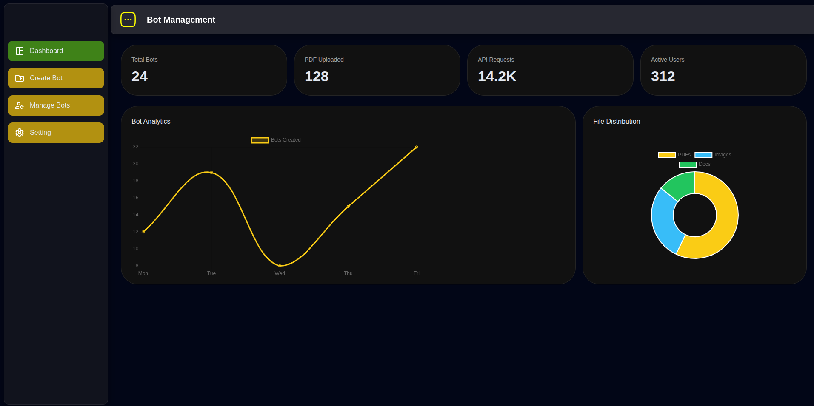
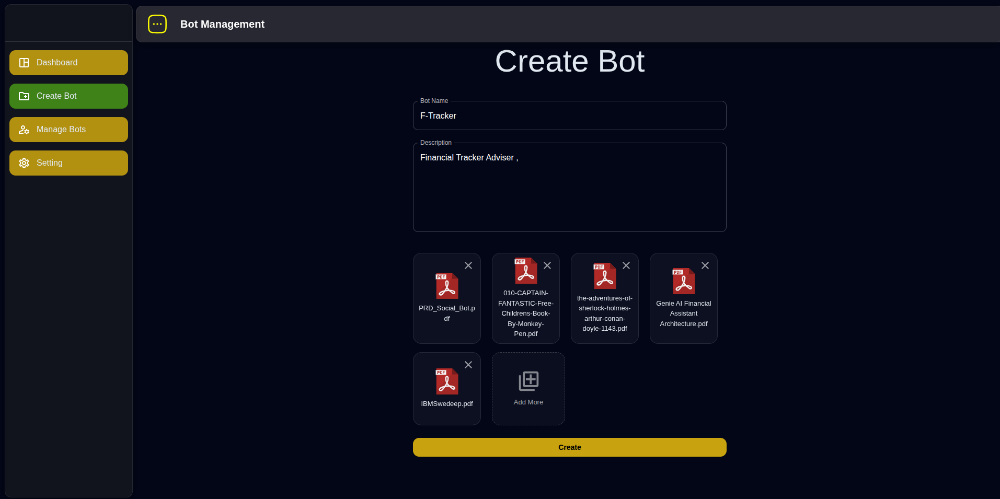
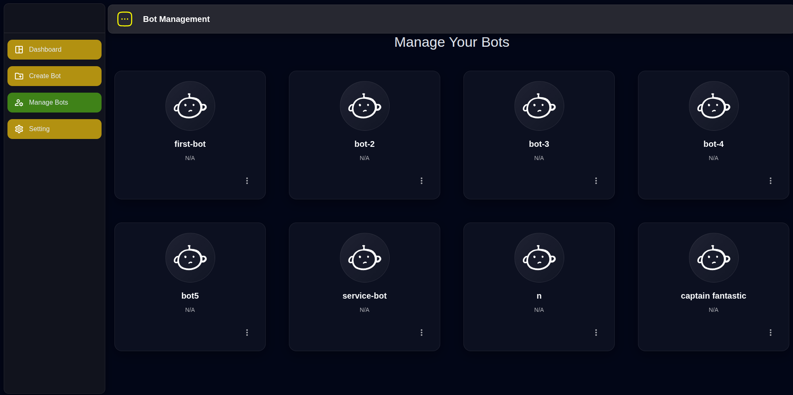
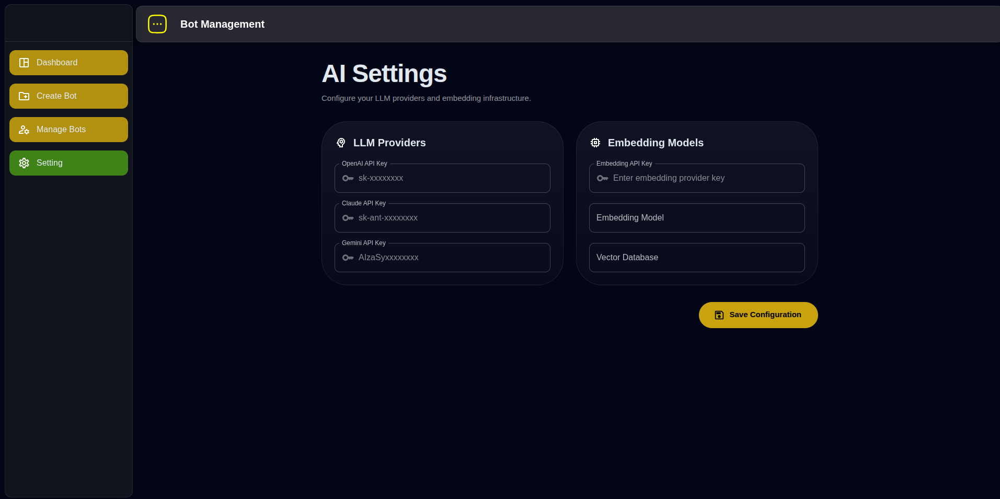

# RAG Frontend

A modern AI-powered RAG (Retrieval-Augmented Generation) frontend dashboard built with:

- React
- TypeScript
- Vite
- Material UI (MUI)
- React Router
- Chart.js

This project provides a clean admin dashboard for managing bots, uploading PDFs, configuring AI providers, and visualizing analytics.

---

# Features

- AI Bot Management Dashboard
- Persistent Sidebar Navigation
- Dynamic Nested Routing
- Drag & Drop PDF Upload
- Multiple File Upload Support
- File Preview Cards
- AI Provider Configuration
- Dashboard Analytics
- Doughnut & Line Charts
- Glassmorphism UI
- Dark Theme Support
- Reusable Component Architecture

---

# Tech Stack

| Technology | Usage |
|---|---|
| React | Frontend Library |
| TypeScript | Type Safety |
| Vite | Build Tool |
| Material UI | UI Components |
| React Router DOM | Routing |
| Chart.js | Analytics Charts |
| Axios | API Requests |

---

# Folder Structure

```bash
frontend/
├── public/
├── screenshots/
├── src/
│   ├── assets/
│   │   └── icons/
│   ├── components/
│   ├── pages/
│   ├── theme/
│   ├── App.tsx
│   ├── main.tsx
│   └── route.tsx
├── package.json
└── vite.config.ts
```

---

# Installation

```bash
git clone <repo-url>

cd frontend

npm install
```

---

# Run Development Server

```bash
npm run dev
```

---

# Build Production

```bash
npm run build
```

---

# Dashboard Screenshots

## Dashboard



The analytics dashboard provides:

- Bot metrics
- Charts & usage analytics
- Clean SaaS-inspired UI
- Responsive layout system

---

## Create Bot



Features:

- Bot creation form
- PDF drag & drop upload
- Multiple file support
- File preview cards
- Dynamic upload handling

---

## Bot Management



Features:

- Bot listing
- Action menus
- Bot overview cards
- Manage existing AI bots

---

## Settings



Features:

- LLM API configuration
- Embedding model settings
- Provider management
- Clean glassmorphism UI

---

# Routing

Nested routing is implemented using:

```tsx
<Route path="/newhome" element={<NewHome />}>
  <Route path="dashboard" element={<Dashboard />} />
  <Route path="create-bot" element={<CreateBot />} />
  <Route path="manage-bots" element={<ManageBots />} />
  <Route path="settings" element={<Settings />} />
</Route>
```

---

# Theme System

The project uses a centralized MUI theme configuration:

```tsx
theme/
└── theme.ts
```

Customizations include:

- Dark mode
- Custom component overrides
- Glassmorphism styling
- Global typography
- Drawer & AppBar styling

---

# Charts

Analytics are built using:

```bash
chart.js
react-chartjs-2
```

Supported charts:

- Doughnut Chart
- Line Chart
- Metrics Cards

---

# Upload System

Supports:

- Drag & Drop
- Multiple PDF Upload
- Duplicate Filtering
- Dynamic File Preview
- File Removal

---

# Future Improvements

- Authentication Persistence
- WebSocket Realtime Analytics
- Bot Chat Interface
- Team Collaboration
- Vector Database Integration
- AI Streaming Responses
- Usage Billing Dashboard

---

# Author

Built for experimenting with:

- RAG systems
- AI dashboards
- frontend architecture
- modern SaaS UI systems
- AI tooling platforms